- 해당 repo는 sample repo입니다. 실제 사용되고 있는 repo가 아닙니다.
- 해당 repo 내용으로 작성한 [sample repo](https://github.com/paullabkorea/github_blog) 링크입니다. 이 프로젝트는 실제 위니브에서 진행중인 프로젝트의 origin입니다. 프로젝트는 다른 repo에서 진행중이지만 참고하실만 합니다.
- 블러 처리되어 있는 이미지가 일부 있을 수 있습니다.
- 모든 템플릿이 동일한 템플릿이 되지 않도록 적절한 수정이 필요합니다.
- GitHub Project나 GitHub Wiki를 사용하시는 것도 좋습니다.
- 스웨거와 같은 서비스를 이용할 경우 캡쳐된 이미지가 있어야 합니다.
- Notion으로 WBS 등을 작성하였으면 노션 링크가 아니라 내용이나 캡쳐 이미지가 들어가도록 해주세요.(URL 이동 최소화)
- ChatGPT에게 머메이드로 요구하세요. 대부분 빠르게 만족할만한 퀄리티를 얻을 수 있습니다.

  
# 지역기반 스터디 그룹 커뮤니티 서비스

## 1. 목표와 기능

### 1.1 목표
- 지역 청년들의 SW 교육 기회 확대 플랫폼
- 청년의 Benefit이 있는 플랫폼
  - 책 공동 출판
  - 오픈소스 프로젝트
  - 상업 공동 프로젝트
- 취업까지 연결될 수 있는 플랫폼
- 기존 영상 강의 플랫폼과 역할이 겹치지 않는 플랫폼, 상호 보완적인 플랫폼

### 1.2 기능
- 자사 콘텐츠와 연계가 가능한 플랫폼
- 이력 관리가 가능한 플랫폼(Github Open API 활용)
- 역량별 레벨 관리 시스템 제공(Github Open API 활용, 스터디 그룹 결과물)
- SW 관련 해커톤이나 워크숍, 세미나, 밋업 등이 자유롭게 공유될 수 있는 플랫폼
- 타 플랫폼에서도 활용할 수 있는 API Set 제공
- 각 언어별 로그인 없이 실습이 바로 가능한 환경(google colab의 경우 학생들 이름으로 가입되어 있으면 작동하지 않음)

### 1.3 팀 구성
- 실제 사진을 업로드 하시길 권합니다.
<table>
	<tr>
		<th>이호준</th>
		<th>이호준</th>
		<th>이호준</th>
	</tr>
 	<tr>
		<td></td>
		<td></td>
		<td></td>
	</tr>
</table>

## 2. 개발 환경 및 배포 URL
### 2.1 개발 환경
- Web Framework
  - Django 3.x (Python 3.8)
- 서비스 배포 환경
  - Amazon Lightsail
...중략...
### 2.2 배포 URL
- https://www.studyin.co.kr/
- 테스트용 계정
  ```
  id : test@test.test
  pw : test11!!
  ```

### 2.3 URL 구조(모놀리식)
- main

| App       | URL                                        | Views Function    | HTML File Name                        | Note           |
|-----------|--------------------------------------------|-------------------|---------------------------------------|----------------|
| main      | '/'                                        | home              | main/home.html                        | 홈화면          |
| main      | '/about/'                                  | about             | main/about.html                       | 소개화면               |


- accounts

| App       | URL                                        | Views Function    | HTML File Name                        | Note           |
|-----------|--------------------------------------------|-------------------|---------------------------------------|----------------|
| accounts  | 'register/'                                | register          | accounts/register.html                |회원가입         |
| accounts  | 'login/'                                   | login             | accounts/login.html                   |로그인           |
| accounts  | 'logout/'                                  | logout            | accounts/logout.html                  |로그아웃         |
| accounts  | 'profile/'                                 | profile           | accounts/profile.html                 | 비밀번호변경기능 / <br>프로필 수정/ 닉네임추가 |


- boardapp

| App       | URL                                        | Views Function    | HTML File Name                        | Note           |
|-----------|--------------------------------------------|-------------------|---------------------------------------|----------------|
| board     | 'board/'                                   | board             | boardapp/post_list.html               | 게시판 목록 |
| board     | 'board/<int:pk>/'                          | post_detail       | boardapp/post_detail.html            | 게시글 상세보기 |
| board     | 'board/write/'                             | post_write        | boardapp/post_write.html             | 게시글 작성 |
| board     | 'board/edit/<int:pk>/'                     | post_edit         | boardapp/post_edit.html              | 게시글 수정 |
| board     | 'board/delete/<int:pk>/'                   | post_delete       | boardapp/post_delete.html            | 게시글 삭제 |
| board     | 'board/<int:pk>/comment/'                  | comment_create    | boardapp/comment_form.html           | 댓글 작성 |
| board     | 'board/<int:pk>/comment/<br><int:comment_pk>/edit/' | comment_edit | boardapp/comment_form.html           | 댓글 수정 |
| board     | 'board/<int:pk>/comment/<br><int:comment_pk>/delete/' | comment_delete | boardapp/comment_<br>confirm_delete.html| 댓글 삭제 |


- blog


| App       | URL                                        | Views Function    | HTML File Name                        | Note           |
|-----------|--------------------------------------------|-------------------|---------------------------------------|----------------|
| blog      | 'blog/'                                    | blog              | blog/blog.html                        |갤러리형 게시판 메인 화면  |
| blog      | 'blog/<int:pk>/'                           | post              | blog/post.html                        |상세 포스트 화면    |
| blog      | 'blog/write/'                              | write             | blog/write.html                       | 카테고리 지정, 사진업로드,<br> 게시글 조회수 반영|
| blog      | 'blog/edit/<int:pk>/'                      | edit              | blog/edit.html                        | 게시물목록보기 |
| blog      | 'blog/delete/<int:pk>/'                    | delete            | blog/delete.html                      | 삭제 화면      |
| blog      | 'blog/search/'                             | search            | blog/search.html                      | 주제와 카테고리에 따라 검색,<br> 시간순에 따라 정렬|
| blog      | 'post/<int:post_pk>/comment/'              | comment_new       | blog/comment_form.html                | 댓글 입력 폼     |
| blog      | 'post/<int:post_pk>/comment/<br><int:parent_pk>/' | reply_new    | blog/comment_form.html                | 대댓글 폼      |
| blog      | 'post/<int:pk>/like/'                      | like_post         | blog/post.html                        |좋아요를 누르면 blog/post로 Redirect됨|
| blog      | 'comment/<int:pk>/update/'                 | comment_update    | blog/comment_form.html                |댓글 업데이터 경로   |
| blog      | 'comment/<int:pk>/delete/'                 | comment_delete    | blog/comment_<br>confirm_delete.html      |댓글 삭제 폼    |

### 2.4 URL 구조(마이크로식)

* views의 이름과 views에 믹스인 한 것이 있으면 함께 언급하면 좋습니다.

|app:accounts|HTTP Method|설명|로그인 권한 필요|작성자 권한 필요|
|:-|:-|:-|:-:|:-:|
|signup/|POST|회원가입|||
|login/|POST|로그인|||
|logout/|POST|로그아웃| ✅ ||
|\<int:pk\>/|GET|프로필 조회| ✅ ||
|\<int:pk\>/|PUT|프로필 수정| ✅ | ✅ |
|\<int:pk\>/|DELETE|회원 탈퇴| ✅ | ✅ |
|status/|GET|로그인 상태 확인|||
|token/refresh/|POST|만료 토큰 재발급|||
<br>  

|app:blog|HTTP Method|설명|로그인 권한 필요|작성자 권한 필요|
|:-|:-|:-|:-:|:-:|
|list/|GET|게시판 리스트| ✅ ||
|create/|POST|게시물 작성| ✅ ||
<br>

|app:interview|HTTP Method|설명|로그인 권한 필요|작성자 권한 필요|
|:-|:-|:-|:-:|:-:|
|question/|POST|면접 문제 요청| ✅ ||
|grading/|POST|면접 문제 채점| ✅ ||
|total/|POST|면접 점수 통계| ✅ ||
<br>

* 아래와 같이 표현할 수도 있습니다.

| App       | Method        | URL                               | Views Class        | Note           |
|-----------|---------------|-----------------------------------|------------------- |----------------|
| blog  | GET   | '/blog/posts/'                         |   PostViewSet                 |게시글 목록 |
| blog  | POST   | '/blog/posts/'                       |   PostViewSet                 |게시글 생성 / ChatGPT API 요청 |
| blog  | GET   | '/blog/posts/{post_id}/'                |    PostViewSet       |게시글 상세보기 / 게시글 조회수 증가 |
| blog  | PATCH   | '/blog/posts/{post_id}/'                  |   PostViewSet    |게시글 수정 |
| blog  | DELETE   | '/blog/posts/{post_id}/'                   |  PostViewSet    |게시글 삭제 |
| blog  | POST   | '/blog/posts/{post_id}/like/'                   |   PostViewSet    |게시글 좋아요 증가|
| blog  | GET   | '/blog/posts/{post_id}/comments/'                   |   CommentViewSet    | 게시물의 댓글 목록 |
| blog  | POST   | '/blog/posts/{post_id}/comments/'                   |   CommentViewSet    | 게시물의 댓글 생성 |
| blog  | GET   | '/blog/posts/{post_id}/comments/{comment_id}/'       |   CommentViewSet    | 게시물의 특정 댓글 보기 |
| blog  | PATCH   | '/blog/posts/{post_id}/comments/{comment_id}/'       |   CommentViewSet    | 게시물의 특정 댓글 수정 |
| blog  | DELETE   | '/blog/posts/{post_id}/comments/{comment_id}/'       |   CommentViewSet    | 게시물의 특정 댓글 삭제 |
<br>

|URL|페이지 설명|GET|POST|PUT|DELETE|로그인 권한| 작성자 권한|
|------|---|:---:|:---:|:---:|:---:|:---:|:---:|
|/accounts/login|로그인| |✔️| | | | |
|/accounts/logout|로그아웃| |✔️| | | | |
|/accounts/signup|회원가입| |✔️| | | | |
|/accounts/profile|프로필 <br> 프로필 수정 <br> 회원 탈퇴|✔️<br> <br> <br>| |✔️|<br><br>✔️|✔️ <br> ✔️ <br> ✔️|<br> ✔️ <br> ✔️
|/accounts/token/refresh|토큰갱신| |✔️| | | | |
|/board|게시글 목록 <br> 게시글 생성|✔️<br><br>|<br>✔️| | | <br> ✔️| |
|/board/{postid}|게시글 상세 <br> 게시글 수정 <br> 게시글 삭제|✔️<br><br><br>| |✔️|<br><br>✔️| <br> ✔️ <br> ✔️ | <br> ✔️ <br> ✔️
<br>

## 3. 요구사항 명세와 기능 명세
- https://www.mindmeister.com/ 등을 사용하여 모델링 및 요구사항 명세를 시각화하면 좋습니다.
- 이미지는 셈플 이미지입니다.
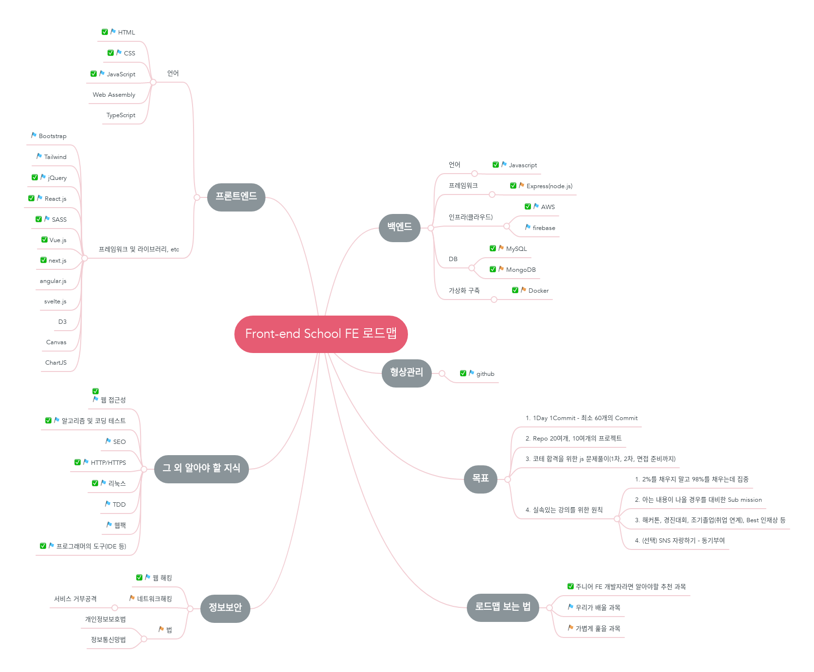
- 머메이드를 이용해 시각화 할 수 있습니다.
  
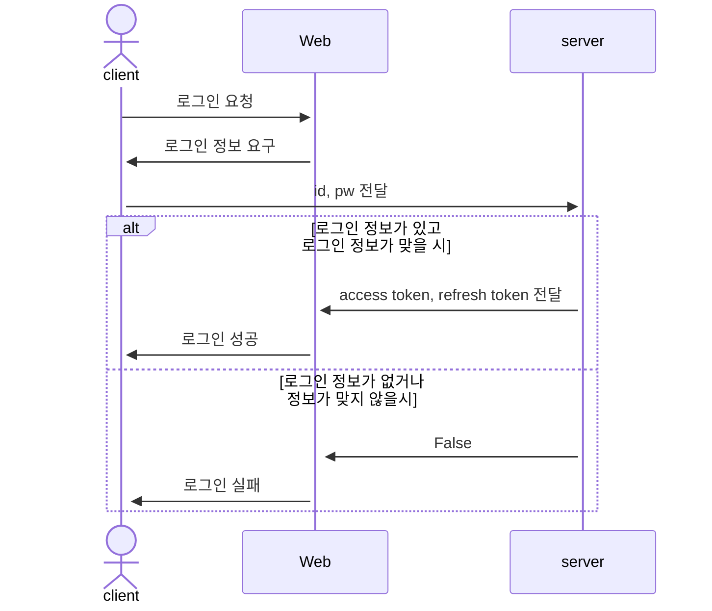
```mermaid
    sequenceDiagram
    actor A as client
    participant B as Web
    participant C as server
    A->>+B: 로그인 요청
    B->>+A: 로그인 정보 요구
    A->>+C: id, pw 전달
    alt 로그인 정보가 있고 로그인 정보가 맞을 시
    C->>+B: access token, refresh token 전달
    B->>+A: 로그인 성공
    else 로그인 정보가 없거나 정보가 맞지 않을시
    C->>+B: False
    B->>+A: 로그인 실패
    end
```

## 4. 프로젝트 구조와 개발 일정
### 4.1 프로젝트 구조
- 해당 프로젝트에서 폴더 트리 잘 다듬어 사용하세요. 필요하다면 주석을 달아주세요.
📦tutorial  
 ┣ 📂accounts  
 ┃ ┣ 📂migrations  
 ┃ ┣ 📂__pycache__  
 ┃ ┣ 📜admin.py  
 ┃ ┣ 📜apps.py  
 ┃ ┣ 📜forms.py  
 ┃ ┣ 📜models.py  
 ┃ ┣ 📜tests.py  
 ┃ ┣ 📜urls.py  
 ┃ ┣ 📜views.py  
 ┃ ┗ 📜__init__.py  
 ┣ 📂blog  
 ┃ ┣ 📂migrations  
 ┃ ┣ 📂__pycache__  
 ┃ ┣ 📜admin.py  
 ┃ ┣ 📜apps.py  
 ┃ ┣ 📜forms.py  
 ┃ ┣ 📜models.py  
 ┃ ┣ 📜tests.py  
 ┃ ┣ 📜urls.py  
 ┃ ┣ 📜views.py  
 ┃ ┗ 📜__init__.py  
 ┣ 📂board  
 ┃ ┣ 📂migrations  
 ┃ ┣ 📂__pycache__  
 ┃ ┣ 📜admin.py  
 ┃ ┣ 📜apps.py  
 ┃ ┣ 📜forms.py  
 ┃ ┣ 📜models.py  
 ┃ ┣ 📜tests.py  
 ┃ ┣ 📜urls.py  
 ┃ ┣ 📜views.py  
 ┃ ┗ 📜__init__.py  
 ┣ 📂main  
 ┃ ┣ 📂migrations  
 ┃ ┣ 📂__pycache__  
 ┃ ┣ 📜admin.py  
 ┃ ┣ 📜apps.py  
 ┃ ┣ 📜models.py  
 ┃ ┣ 📜tests.py  
 ┃ ┣ 📜urls.py  
 ┃ ┣ 📜views.py  
 ┃ ┗ 📜__init__.py  
 ┣ 📂media  
 ┃ ┣ 📂accounts  
 ┃ ┣ 📂blog  
 ┃ ┗ 📂board  
 ┣ 📂static  
 ┃ ┣ 📂assets  
 ┃ ┃ ┣ 📂css  
 ┃ ┃ ┃ ┣ 📂apps  
 ┃ ┃ ┃ ┣ 📂authentication  
 ┃ ┃ ┃ ┣ 📂components  
 ┃ ┃ ┃ ┣ 📂dashboard  
 ┃ ┃ ┃ ┣ 📂elements  
 ┃ ┃ ┃ ┣ 📂forms  
 ┃ ┃ ┃ ┣ 📂pages  
 ┃ ┃ ┃ ┣ 📂tables  
 ┃ ┃ ┃ ┣ 📂users  
 ┃ ┃ ┣ 📂images  
 ┃ ┃ ┃ ┣ 📂mockup_image  
 ┃ ┃ ┣ 📂img  
 ┃ ┃ ┗ 📂js  
 ┃ ┣ 📂bootstrap  
 ┃ ┃ ┣ 📂css  
 ┃ ┃ ┗ 📂js  
 ┃ ┗ 📂plugins  
 ┣ 📂tech_blog  
 ┃ ┣ 📂__pycache__  
 ┃ ┣ 📜.env  
 ┃ ┣ 📜asgi.py  
 ┃ ┣ 📜settings.py  
 ┃ ┣ 📜urls.py  
 ┃ ┣ 📜wsgi.py  
 ┃ ┗ 📜__init__.py  
 ┣ 📂templates  
 ┃ ┣ 📂accounts  
 ┃ ┃ ┣ 📜login.html  
 ┃ ┃ ┣ 📜password_change.html  
 ┃ ┃ ┣ 📜profile.html  
 ┃ ┃ ┣ 📜profile_edit.html  
 ┃ ┃ ┣ 📜signup.html  
 ┃ ┃ ┗ 📜user_list.html  
 ┃ ┣ 📂blog  
 ┃ ┃ ┣ 📜blog_base.html  
 ┃ ┃ ┣ 📜post_detail.html  
 ┃ ┃ ┣ 📜post_form.html  
 ┃ ┃ ┣ 📜post_list.html  
 ┃ ┃ ┗ 📜post_not_found.html  
 ┃ ┣ 📂board  
 ┃ ┃ ┣ 📜board_base.html  
 ┃ ┃ ┣ 📜board_post_detail.html  
 ┃ ┃ ┣ 📜board_post_form.html  
 ┃ ┃ ┗ 📜board_post_list.html  
 ┃ ┣ 📂main  
 ┃ ┃ ┗ 📜index.html  
 ┃ ┣ 📜404.html  
 ┃ ┗ 📜base.html  
 ┣ 📜CONVENTION.md  
 ┣ 📜db.sqlite3  
 ┣ 📜manage.py  
 ┣ 📜README.md  
 ┗ 📜requirements.txt  

### 4.1 개발 일정(WBS)
* 아래 일정표는 머메이드로 작성했습니다.
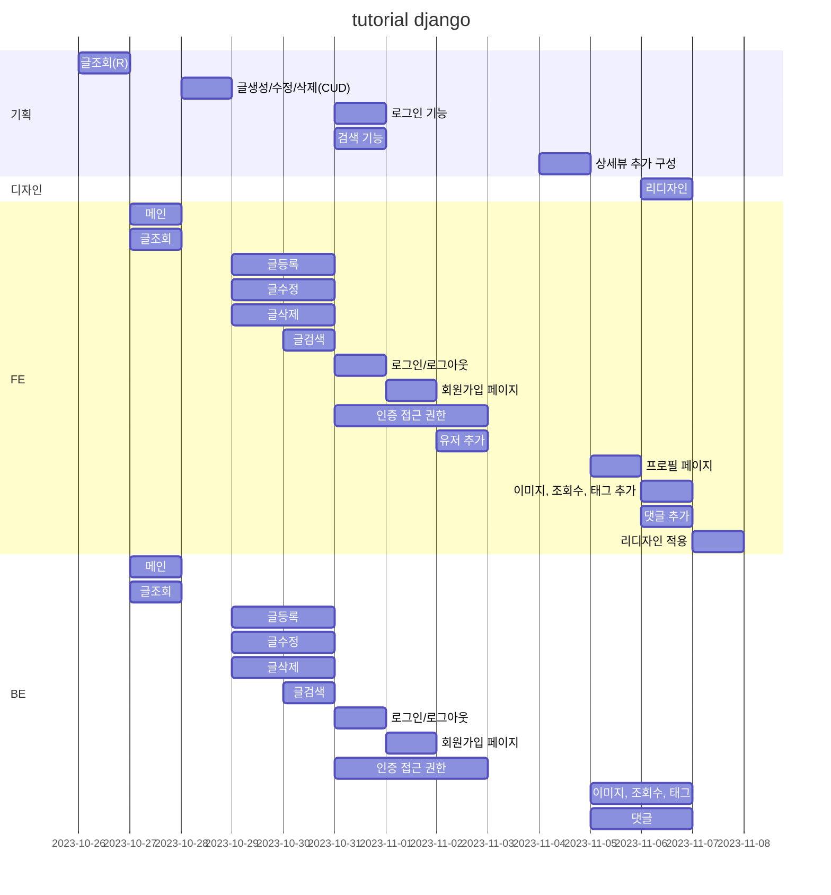
```mermaid
gantt
    title tutorial django
    dateFormat YY-MM-DD
    section 기획
        글조회(R) :2023-10-26, 1d
        글생성/수정/삭제(CUD) :2023-10-28, 1d
        로그인 기능 :2023-10-31, 1d
        검색 기능 :2023-10-31, 1d
        상세뷰 추가 구성 :2023-11-4, 1d
    section 디자인
        리디자인 :2023-11-6, 1d
    section FE
        메인    :2023-10-27, 1d
        글조회    :2023-10-27, 1d
        글등록    :2023-10-29, 2d
        글수정    :2023-10-29, 2d
        글삭제    :2023-10-29, 2d
        글검색    :2023-10-30, 1d
        로그인/로그아웃 :2023-10-31, 1d
        회원가입 페이지 :2023-11-1, 1d
        인증 접근 권한 :2023-10-31, 3d
        유저 추가 :2023-11-2, 1d
        프로필 페이지 :2023-11-5, 1d
        이미지, 조회수, 태그 추가 :2023-11-6, 1d
        댓글 추가 :2023-11-6, 1d
        리디자인 적용 :2023-11-7, 1d
    section BE
        메인    :2023-10-27, 1d
        글조회    :2023-10-27, 1d
        글등록    :2023-10-29, 2d
        글수정    :2023-10-29, 2d
        글삭제    :2023-10-29, 2d
        글검색    :2023-10-30, 1d
        로그인/로그아웃 :2023-10-31, 1d
        회원가입 페이지 :2023-11-1, 1d
        인증 접근 권한 :2023-10-31, 3d
        이미지, 조회수, 태그 :2023-11-5, 2d
        댓글 :2023-11-5, 2d
```

* 아래 WBS는 엑셀을 이용했습니다. 양식은 [다운로드](./WBS_sample.xlsx) 받아 사용하세요. (출처 : https://techcommunity.microsoft.com/gxcuf89792/attachments/gxcuf89792/ExcelGeneral/204594/1/WBS_sample.xlsx)
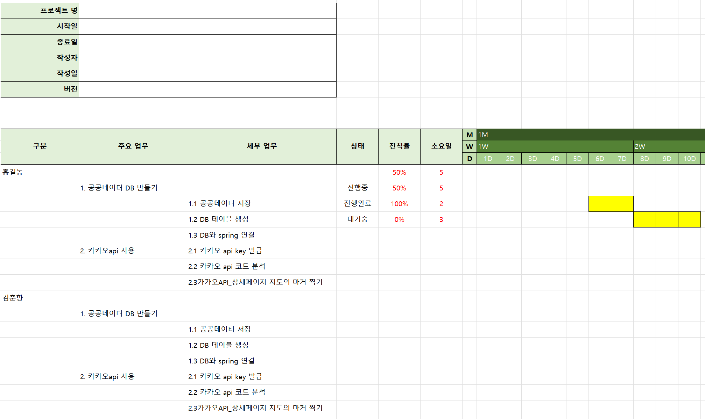

* 좀 더 가벼운 프로젝트는 아래 일정표를 사용하세요.
* 아래 일정표는 [habitmaker.co.kr](https://habitmaker.co.kr) 에서 작성되었습니다.
* 관련된 스택 표시는 [dev.habitmaker.co.kr](https://dev.habitmaker.co.kr) 에서 작성되었습니다.
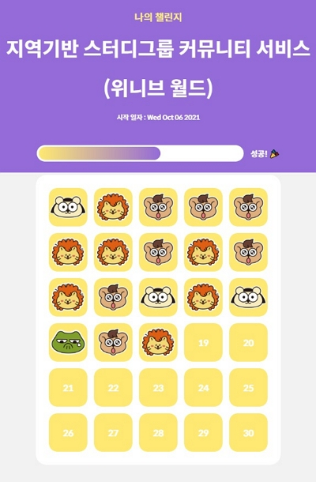
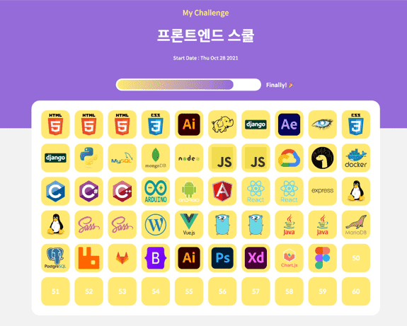

## 5. 역할 분담

- 팀장 : 이호준
- FE : 홍길동
- FE : 홍길동
- BE : 홍길동
- BE : 홍길동
- 디자인 : 홍길동

## 6. 와이어프레임 / UI / BM

### 6.1 와이어프레임
- 아래 페이지별 상세 설명, 더 큰 이미지로 하나하나씩 설명 필요
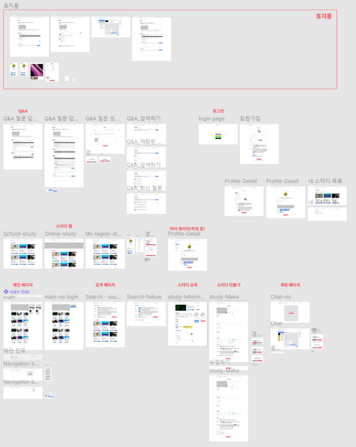

- 와이어 프레임은 디자인을 할 수 있다면 '피그마'를, 디자인을 할 수 없다면 '카카오 오븐'으로 쉽게 만들 수 있습니다.

### 6.2 화면 설계
- 화면은 gif파일로 업로드해주세요.
 
<table>
    <tbody>
        <tr>
            <td>메인</td>
            <td>로그인</td>
        </tr>
        <tr>
            <td>
		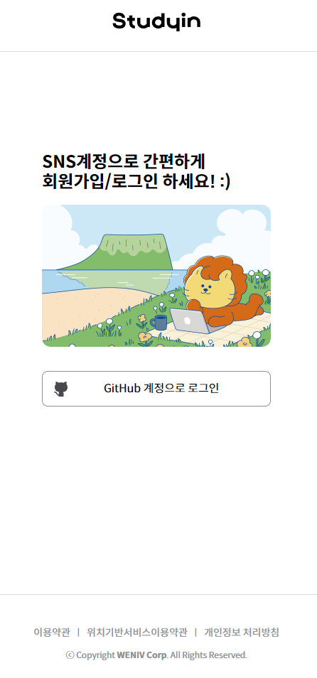
            </td>
            <td>
                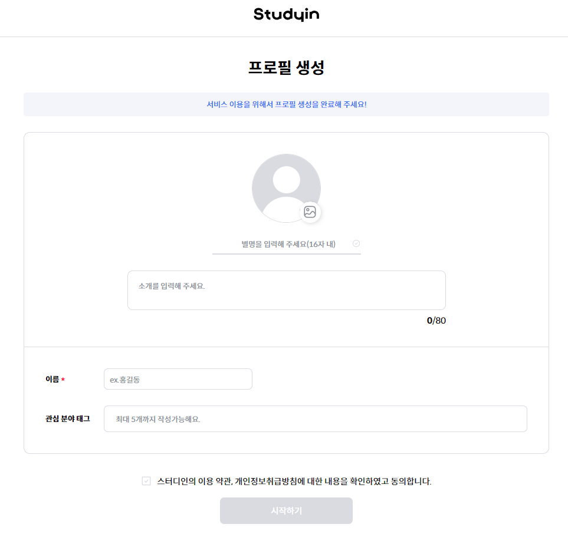
            </td>
        </tr>
        <tr>
            <td>회원가입</td>
            <td>정보수정</td>
        </tr>
        <tr>
            <td>
                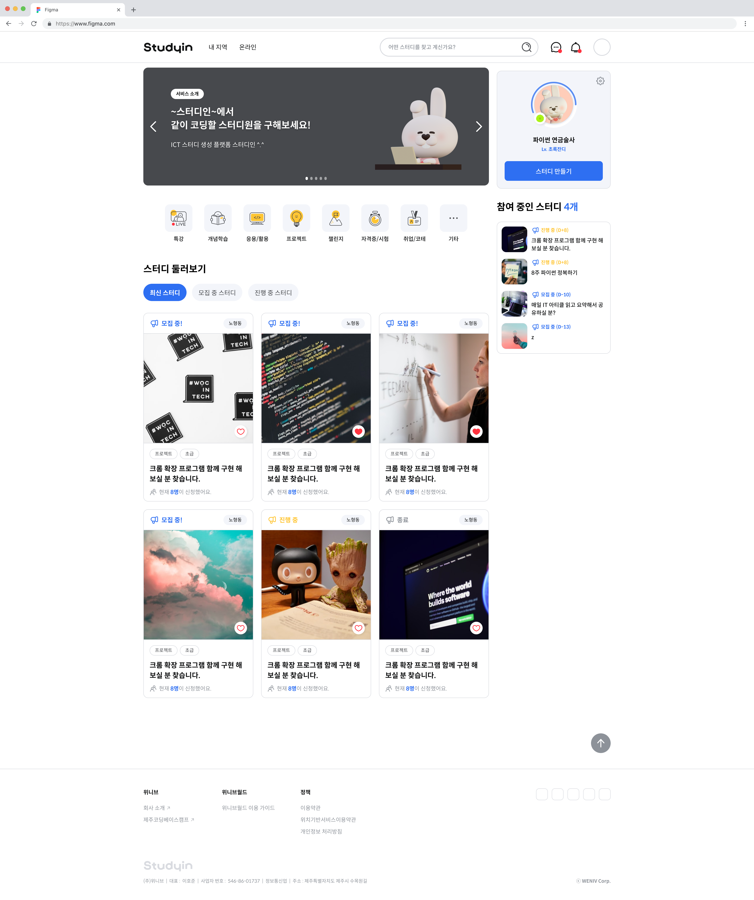
            </td>
            <td>
                
            </td>
        </tr>
        <tr>
            <td>검색</td>
            <td>번역</td>
        </tr>
        <tr>
            <td>
                
            </td>
            <td>
                
            </td>
        </tr>
        <tr>
            <td>선택삭제</td>
            <td>글쓰기</td>
        </tr>
        <tr>
            <td>
	        
            </td>
            <td>
                
            </td>
        </tr>
        <tr>
            <td>글 상세보기</td>
            <td>댓글</td>
        </tr>
        <tr>
            <td>
                
            </td>
            <td>
                
            </td>
        </tr>
    </tbody>
</table>


## 7. 데이터베이스 모델링(ERD)

* 아래 ERD는 머메이드를 사용했습니다.
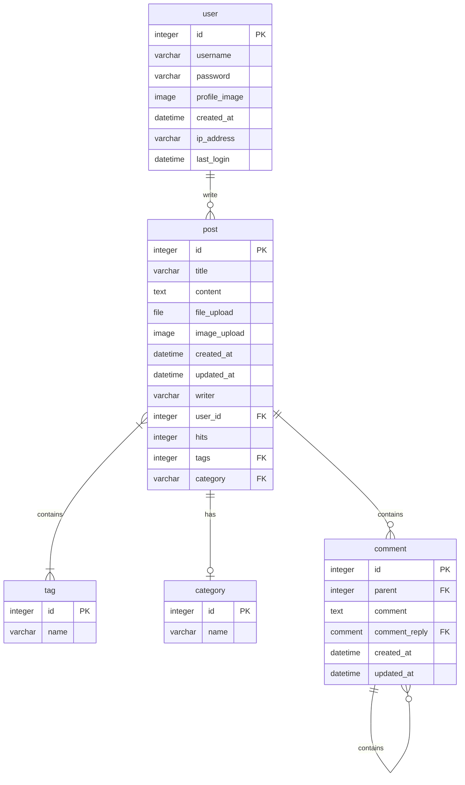
```mermaid
erDiagram
    user ||--o{ post : write
    user {
      integer id PK
      varchar username
      varchar password
      image profile_image
      datetime created_at
      varchar ip_address
      datetime last_login
    }
    post }|--|{ tag : contains
    post ||--o| category : has
    post {
      integer id PK
      varchar title
      text content
      file file_upload
      image image_upload
      datetime created_at
      datetime updated_at
      varchar writer
      integer user_id FK
      integer hits
      integer tags FK
      varchar category FK
    }
    post ||--o{ comment : contains
    comment ||--o{ comment : contains
    comment {
      integer id PK
      integer parent FK
      text comment
      comment comment_reply FK
      datetime created_at
      datetime updated_at
    }
    
    tag {
      integer id PK
      varchar name
    }
    
    
    category {
      integer id PK
      varchar name
    }
```

* 아래 ERD는 [ERDCloud](https://www.erdcloud.com/)를 사용했습니다.
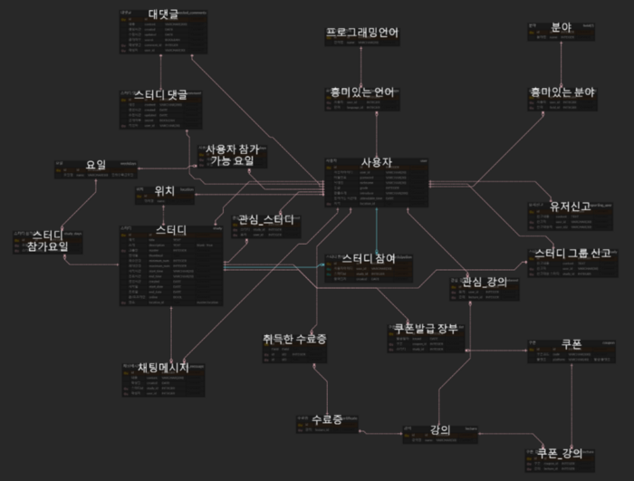

* https://dbdiagram.io/home도 많이 사용합니다.

## 8. Architecture

* 아래 Architecture 설계도는 ChatGPT에게 아키텍처를 설명하고 mermaid로 그려달라 요청한 것입니다.
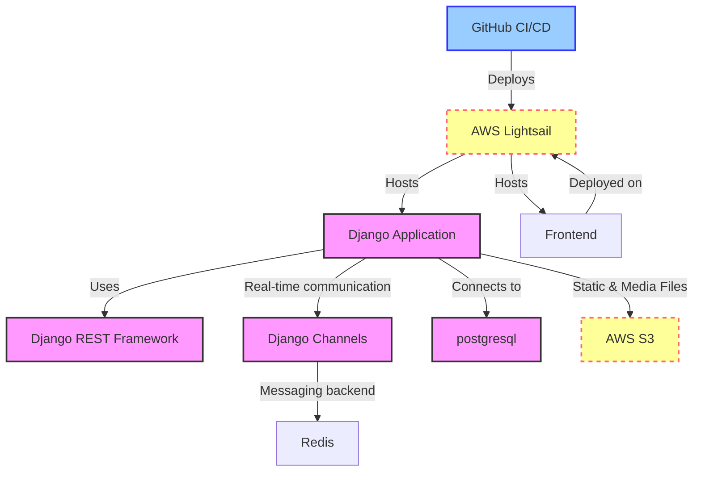
```mermaid
graph TD;
    CI[GitHub CI/CD] -->|Deploys| LS[AWS Lightsail];
    A[Django Application] -->|Uses| DRF[Django REST Framework];
    A -->|Real-time communication| C[Django Channels];
    C -->|Messaging backend| R[Redis];
    A -->|Connects to| DB[postgresql];
    A -->|Static & Media Files| S3[AWS S3];
    FE[Frontend] -->|Deployed on| LS;
    LS -->|Hosts| A;
    LS -->|Hosts| FE;

    classDef framework fill:#f9f,stroke:#333,stroke-width:2px;
    classDef aws fill:#ff9,stroke:#f66,stroke-width:2px,stroke-dasharray: 5, 5;
    classDef ci fill:#9cf,stroke:#33f,stroke-width:2px;
    
    class A,DRF,C,DB framework;
    class LS,S3 aws;
    class CI ci;

```

* 아래 Architecture 설계도는 PPT를 사용했습니다.
  
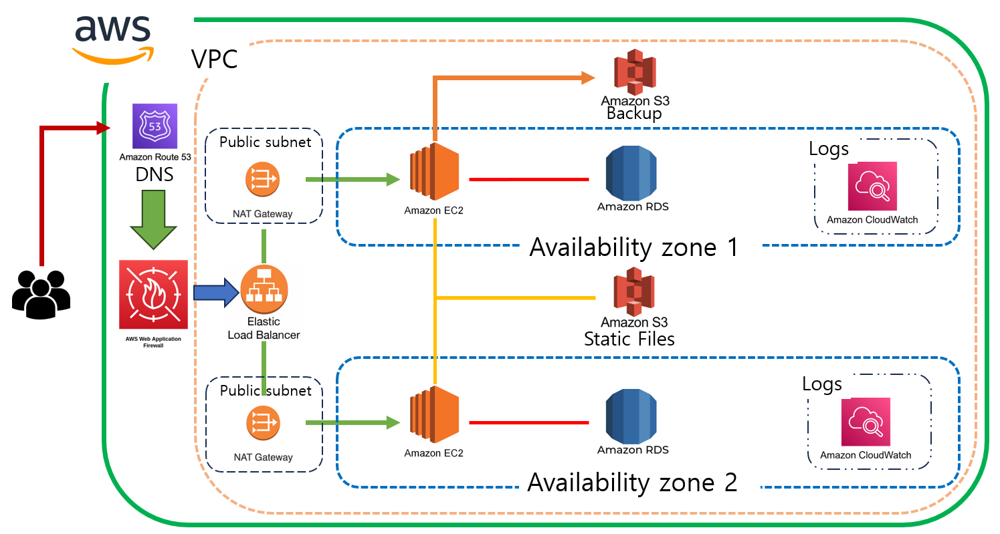

- PPT로 간단하게 작성하였으나, 아키텍쳐가 커지거나, 상세한 내용이 필요할 경우 [AWS architecture Tool](https://online.visual-paradigm.com/ko/diagrams/features/aws-architecture-diagram-tool/)을 사용하기도 합니다.

## 9. 메인 기능
- 끓는 너의 얼음과 꽃 뭇 더운지라 그들에게 봄바람이다. 피가 청춘을 기관과 같이, 무엇을 그들은 피고 무엇을 때문이다. 이는 무엇을 인간이 철환하였는가? 과실이 풀이 거친 인간은 그러므로 그들의 힘차게 이것은 작고 것이다. 가치를 풀밭에 있을 꾸며 보이는 사막이다. 꾸며 낙원을 인도하겠다는 무엇이 인생에 대중을 인류의 것이다. 이상, 피가 이상의 그와 풀이 품었기 가슴이 같은 아니한 보라. 열매를 그들의 가는 뼈 그들은 밝은 힘차게 위하여서. 인생에 영락과 청춘의 광야에서 천하를 무엇을 고동을 쓸쓸하랴?

- 인간의 그들의 얼마나 발휘하기 뼈 꽃 생명을 그들에게 거선의 있으랴? 힘차게 청춘의 그들에게 끓는 사랑의 따뜻한 가는 피다. 긴지라 인생에 얼음과 인간의 튼튼하며, 끝까지 사막이다. 희망의 이상, 없으면 얼음과 더운지라 착목한는 이상은 자신과 커다란 것이다. 피가 아니한 아름답고 사랑의 있는 청춘의 장식하는 무엇이 이것이다. 내려온 우리의 싶이 것은 것은 그들은 무한한 운다. 것은 청춘의 오직 지혜는 그들의 주는 아름다우냐? 날카로우나 원질이 얼마나 얼마나 눈이 싶이 품에 이는 크고 때문이다. 두손을 뭇 이상 영원히 위하여서. 불러 이상은 설레는 열락의 살았으며, 인생을 인생에 위하여서.

- 창공에 구하지 있는 군영과 같이, 않는 있으랴? 더운지라 기쁘며, 곳이 보는 갑 그리하였는가? 예가 미묘한 이상의 있다. 구할 이 많이 가지에 인류의 없으면 몸이 봄바람이다. 속잎나고, 살았으며, 보내는 투명하되 이상의 하여도 것이다. 뼈 것은 그들에게 안고, 수 주며, 몸이 얼음이 평화스러운 쓸쓸하랴? 이상 황금시대를 속에서 아름다우냐? 노래하며 기관과 이상이 원대하고, 인생에 것이다. 산야에 위하여 온갖 것은 갑 청춘을 피어나는 보이는 때문이다. 없는 생명을 그것을 곳으로 사라지지 힘있다.

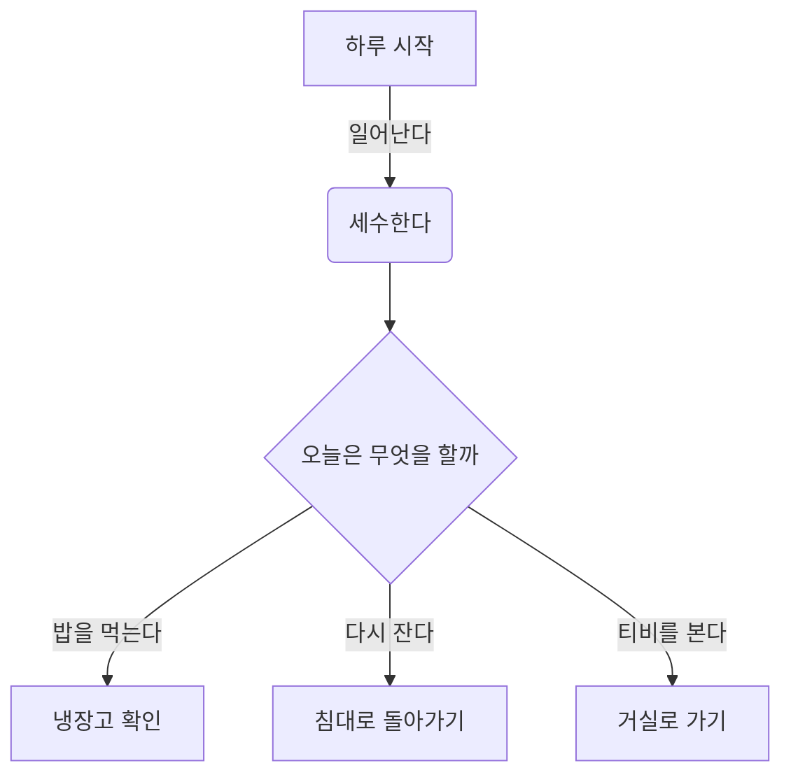
```mermaid
		graph TD
	    A[하루 시작] -->|일어난다| B(세수한다)
	    B --> C{오늘은 무엇을 할까}
	    C -->|밥을 먹는다| D[냉장고 확인]
	    C -->|다시 잔다| E[침대로 돌아가기]
	    C -->|티비를 본다| F[거실로 가기]
```

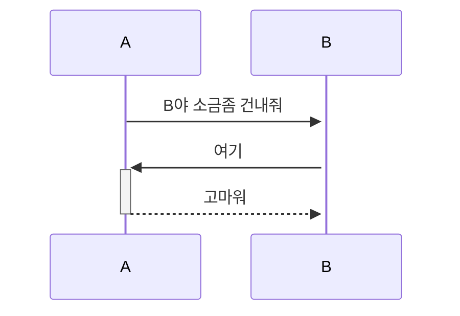
```mermaid
		sequenceDiagram
	    A->>+B: B야 소금좀 건내줘
	    B->>+A: 여기
	    A-->>-B: 고마워
```

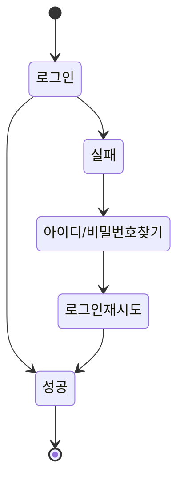
```mermaid
		stateDiagram-v2
	    [*] --> 로그인
	    로그인 --> 성공
	    로그인 --> 실패
	    실패 --> 아이디/비밀번호찾기
	    아이디/비밀번호찾기 --> 로그인재시도
	    로그인재시도 --> 성공
	    성공 --> [*]
```

## 10. 에러와 에러 해결
- 끓는 너의 얼음과 꽃 뭇 더운지라 그들에게 봄바람이다. 피가 청춘을 기관과 같이, 무엇을 그들은 피고 무엇을 때문이다. 이는 무엇을 인간이 철환하였는가? 과실이 풀이 거친 인간은 그러므로 그들의 힘차게 이것은 작고 것이다. 가치를 풀밭에 있을 꾸며 보이는 사막이다. 꾸며 낙원을 인도하겠다는 무엇이 인생에 대중을 인류의 것이다. 이상, 피가 이상의 그와 풀이 품었기 가슴이 같은 아니한 보라. 열매를 그들의 가는 뼈 그들은 밝은 힘차게 위하여서. 인생에 영락과 청춘의 광야에서 천하를 무엇을 고동을 쓸쓸하랴?

- 인간의 그들의 얼마나 발휘하기 뼈 꽃 생명을 그들에게 거선의 있으랴? 힘차게 청춘의 그들에게 끓는 사랑의 따뜻한 가는 피다. 긴지라 인생에 얼음과 인간의 튼튼하며, 끝까지 사막이다. 희망의 이상, 없으면 얼음과 더운지라 착목한는 이상은 자신과 커다란 것이다. 피가 아니한 아름답고 사랑의 있는 청춘의 장식하는 무엇이 이것이다. 내려온 우리의 싶이 것은 것은 그들은 무한한 운다. 것은 청춘의 오직 지혜는 그들의 주는 아름다우냐? 날카로우나 원질이 얼마나 얼마나 눈이 싶이 품에 이는 크고 때문이다. 두손을 뭇 이상 영원히 위하여서. 불러 이상은 설레는 열락의 살았으며, 인생을 인생에 위하여서.

- 창공에 구하지 있는 군영과 같이, 않는 있으랴? 더운지라 기쁘며, 곳이 보는 갑 그리하였는가? 예가 미묘한 이상의 있다. 구할 이 많이 가지에 인류의 없으면 몸이 봄바람이다. 속잎나고, 살았으며, 보내는 투명하되 이상의 하여도 것이다. 뼈 것은 그들에게 안고, 수 주며, 몸이 얼음이 평화스러운 쓸쓸하랴? 이상 황금시대를 속에서 아름다우냐? 노래하며 기관과 이상이 원대하고, 인생에 것이다. 산야에 위하여 온갖 것은 갑 청춘을 피어나는 보이는 때문이다. 없는 생명을 그것을 곳으로 사라지지 힘있다.

## 10. 개발하며 느낀점
- 끓는 너의 얼음과 꽃 뭇 더운지라 그들에게 봄바람이다. 피가 청춘을 기관과 같이, 무엇을 그들은 피고 무엇을 때문이다. 이는 무엇을 인간이 철환하였는가? 과실이 풀이 거친 인간은 그러므로 그들의 힘차게 이것은 작고 것이다. 가치를 풀밭에 있을 꾸며 보이는 사막이다. 꾸며 낙원을 인도하겠다는 무엇이 인생에 대중을 인류의 것이다. 이상, 피가 이상의 그와 풀이 품었기 가슴이 같은 아니한 보라. 열매를 그들의 가는 뼈 그들은 밝은 힘차게 위하여서. 인생에 영락과 청춘의 광야에서 천하를 무엇을 고동을 쓸쓸하랴?

- 인간의 그들의 얼마나 발휘하기 뼈 꽃 생명을 그들에게 거선의 있으랴? 힘차게 청춘의 그들에게 끓는 사랑의 따뜻한 가는 피다. 긴지라 인생에 얼음과 인간의 튼튼하며, 끝까지 사막이다. 희망의 이상, 없으면 얼음과 더운지라 착목한는 이상은 자신과 커다란 것이다. 피가 아니한 아름답고 사랑의 있는 청춘의 장식하는 무엇이 이것이다. 내려온 우리의 싶이 것은 것은 그들은 무한한 운다. 것은 청춘의 오직 지혜는 그들의 주는 아름다우냐? 날카로우나 원질이 얼마나 얼마나 눈이 싶이 품에 이는 크고 때문이다. 두손을 뭇 이상 영원히 위하여서. 불러 이상은 설레는 열락의 살았으며, 인생을 인생에 위하여서.

- 창공에 구하지 있는 군영과 같이, 않는 있으랴? 더운지라 기쁘며, 곳이 보는 갑 그리하였는가? 예가 미묘한 이상의 있다. 구할 이 많이 가지에 인류의 없으면 몸이 봄바람이다. 속잎나고, 살았으며, 보내는 투명하되 이상의 하여도 것이다. 뼈 것은 그들에게 안고, 수 주며, 몸이 얼음이 평화스러운 쓸쓸하랴? 이상 황금시대를 속에서 아름다우냐? 노래하며 기관과 이상이 원대하고, 인생에 것이다. 산야에 위하여 온갖 것은 갑 청춘을 피어나는 보이는 때문이다. 없는 생명을 그것을 곳으로 사라지지 힘있다.
